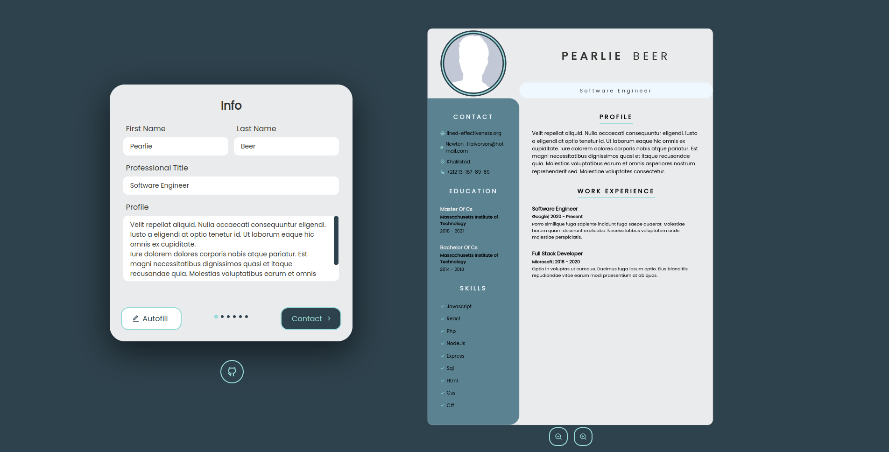

	<h1>Resume Builder App
	 
		
		
		 
	</h1>
	<h3> 👇 Try It Yourself 👇 </h3>

## 📝 Description
My take on building a CV/Resume builder application. 
-I made this app with react. 
-I also used a lot of usefull react hooks. 
-And styled with Css.

## 🛠️ Built with
 * CSS.
 * React.
 * React Hooks.